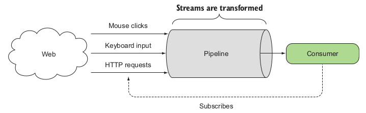
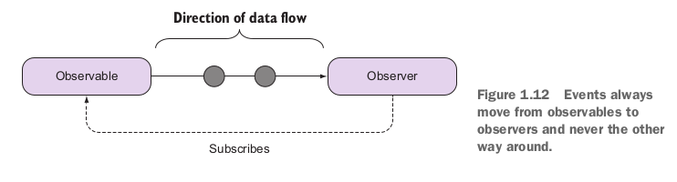
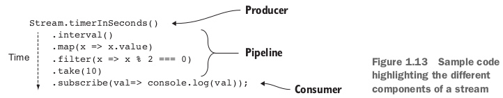

RxJS
===

## Thinking in stream
- Stream was used in programming languages as an abstract object related to I/O operations such as reading a file, reading a socket, or requesting data from an HTTP server.
- Stream is a data flow or data pipeline, a pipeline is a series of logic blocks that will be executed in order when data becomes available.
- A stream is nothing more than a sequence of events over time.

## Stream in RxJS

- You can subscribe to streams and implement functions within the pipeline that will be called (therefore react) when an event occurs.
- Analogy about stream: Excel spreadsheet. You can easily bind functions onto cells that subscribe to the values of other cells and respond in real time as soon as any of the bounded cells change.
- Streams are lazy data types, which means that they execute only after a subscriber is attached.

## Components of an Rx stream
- Producers (Observables)
- Consumers (Observer)
- Data pipeline
- Time

## Ref
- Book RxJS in action - Paul P. Daniels, Luis Atencio