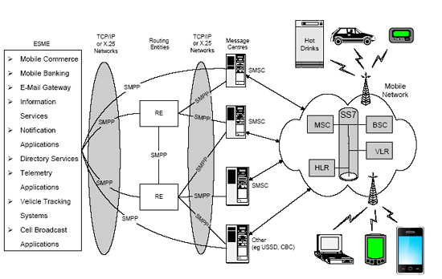

SMPP Protocol
===

## Overview
- **SMPP** (Short Message Peer to Peer) là một chuẩn giao thức mở được thiết kế để áp dụng trong các hệ thống về nhắn tin SMS (Short Message Service). 
- SMPP là giao thức giúp vẫn chuyện các Short Message giữa các **ESME** (External Short Message Entities) và các Message Center thông qua một interface giúp xử lý giao tiếp dữ liễu một cách linh hoạt.
- Muốn sử dụng được SMPP cần phải đăng ký và host từ một service provider, ở đây có thể là một **SMSC** (Short Message Service Centre). Sau khi đã đăng ký, ta sẽ có được một sô thông tin từ service provider như: IP và port của SMSC, username (system id) và password.
- Ứng dụng sử dụng SMPP sẽ theo mô hình client và server, SMPP Server sẽ listen trên port đã đc cung cấp từ SMSC, SMPP Client sẽ kết nối đến SMPP Server thông qua address có dạng (smpp://[SMSC's IP]:[SMSC's port]).
- Khi cài đặt SMPP Server ta sẽ sử dụng các thư viện về network trong một số ngôn ngữ, thường mỗi ngôn ngữ sẽ có một thư viện (có thể open source) viếc sẵn cho SMPP.
- Các gói tin của SMPP vận chuyện gọi là PDU (Protocal Data Units).
- Để sử dụng được SMPP cần phải thiết lập một SMPP session (dựa trên TCP/IP) giữa ESME và SMSC (Message Centre - MC). 
- Có 3 kiểu session:
  - Transmitter (TX): ESME -> SMSC, ESME chỉ gửi message đến SMSC.
  - Receiver (RX): SMSC -> ESME, ESME chỉ nhận message từ SMSC.
  - Transceiver (TRX): Kết hợp giữa TX và TRX. ESME có thể gửi và nhận từ SMSC và tương tự đối với SMSC.
  
## Một số Use Case sử dụng SMPP
- Ứng dụng thông báo Voicemail dùng để xác định các tin nhắn thoại ở mailbox của customer.
- Ứng dụng dịch vụ thông tin. Ví dụ, ứng dụng cho phep người dùng mobile truy vấn thông tin về tỉ giá tiền tệ thông qua tin nhắn SMS.
- Các dịch vụ tra cứu thông tin qua SMS. Ví dụ, người dụng gọi đến yêu cầu tra cứu thông tin về các nhà hàng trong khu vực, các thông tin sau đó sẽ được gửi về thông qua SMS.
- Các ứng dụng location-based, kết hợp với một sô thiết bị phần cứng trên mobile để ESME thu thập dữ liệu thông qua SMS, ví dụ như track taxi hành trình, track trộm xe, logistics...
- Các ứng dụng về security có thể sử dụng SMS để theo dõi và thông báo về trạng thái của thiết bị. Ví dụ, người cha nhận được thông báo SMS từ dịch vụ bảo vệ là con gái đã về nhà và có chìa khóa mở khóa.
- Các ứng dụng Online Banking, E-Commerce như người dùng có thể dùng SMS để trả bill, chuyển tiền hoặc mua hàng thông qua SMS.

## Session
- ESME và SMSC giao tiếp với nhau chủ yếu dựa trên SMPP Session.
- Các states của một SMPP Session:
 - `Open`: Trạng thái ESME đã thiết lập một kết nối mạng (TCP/IP) đến SMSC nhưng chưa request tính hiệu Bind.
 - `Bound_TX`: Một kết mà ESME đã request đến SMSC để bind session ở dạng Transmitter.
 - `Bound_RX`: Một kết mà ESME đã request đến SMSC để bind session ở dạng Receiver.
 - `Bould_TRX`: Một kết mà ESME đã request đến SMSC để bind session ở dạng Transceiver.
 - `Unbound`: ESME đã bould TX, RX hoặc TRX và request unbind đến SMSC để  hủy session.
 - `Closed`: ESME và SMSC đã đống kết nốt mạng.
 - `Outbound`: Ngược lại với Bound, đây là hoạt động cho phép SMSC khởi tạo một SMPP session. Ứng dụng điển hình SMSC muốn chủ động delivery messages cho ESME, cụ thể là để có thể tạo kết nối đến ESME và request các lệnh bind_receiver để SMSC có thể delivery messages cho ESME.