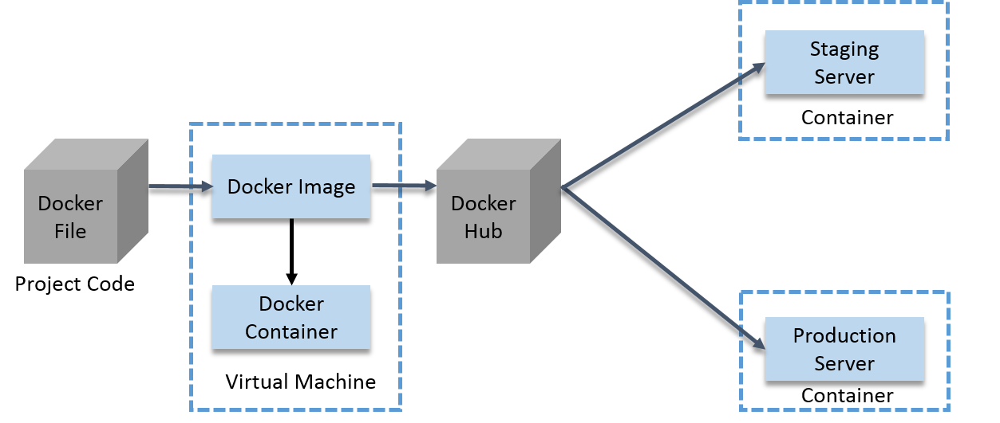

Docker
===

## How a Docker Container work?

- A developer will first write the project code in a Docker file and then build an image from that file.
- This image will contain the entire project code.
- Now, you can run this Docker Image to create as many containers as you want.
- This Docker Image can be uploaded on Docker hub (It is basically a cloud repository for your Docker Images, you can keep it public or private).
- This Docker Image on the Docker hub, can be pulled by other teams such as QA or Prod.

## References
- [What is the purpose of Docker](https://www.quora.com/What-is-the-purpose-of-Docker)
- [Docker for Beginners](https://docker-curriculum.com/#docker-images)